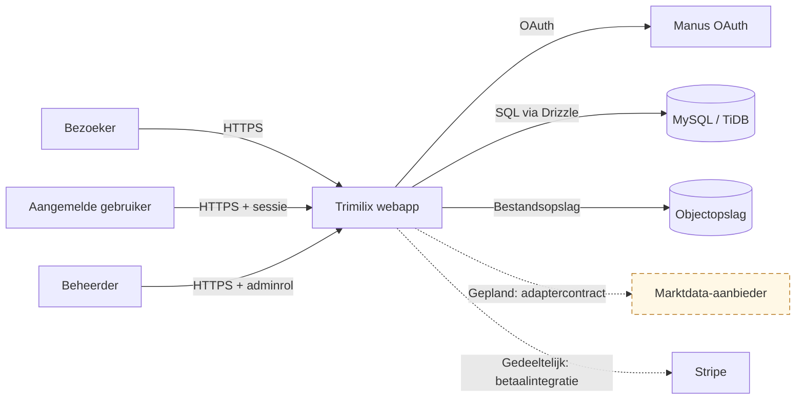
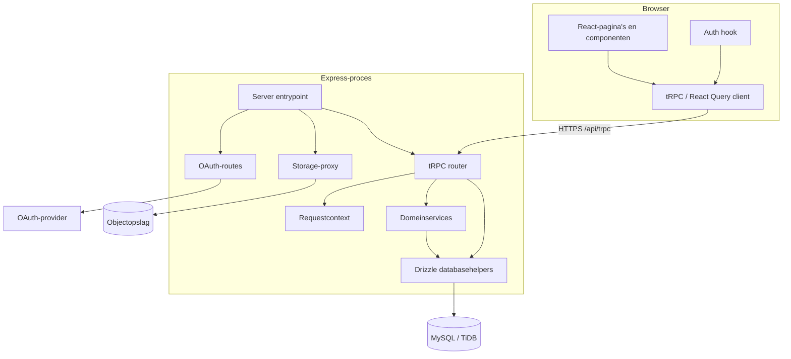
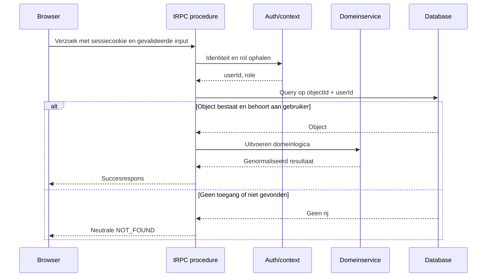
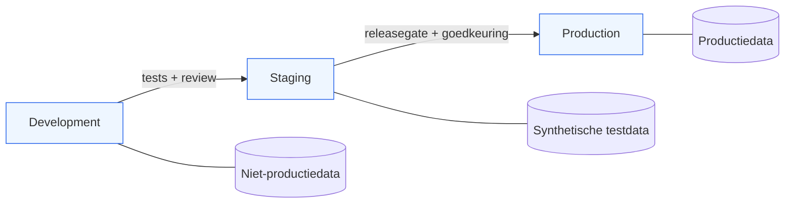

# Architectuur — The Trimilix System™

**Versie:** 1.0  
**Laatst bijgewerkt:** 16 juli 2026  
**Status:** Huidige architectuur met evolutionaire doelrichting

> Dit document maakt bewust onderscheid tussen **geïmplementeerde componenten** en **geplande uitbreidingen**. Een geplande component mag niet als operationeel worden voorgesteld zonder code-, configuratie- en testbewijs.

## 1. Architectuurdoel

Trimilix is vandaag een full-stack modulaire monoliet. Dat model houdt de operationele complexiteit laag en laat snelle, typeveilige ontwikkeling toe. De code wordt wel langs domeingrenzen georganiseerd, zodat marktdata, betalingen, analyses en achtergrondverwerking later onafhankelijk kunnen evolueren wanneer metingen dat rechtvaardigen.

De langetermijnambitie van meer dan 100.000 betalende en 1.000.000 geregistreerde gebruikers wordt ondersteund door **vervangbare componenten, stateless applicatieprocessen, externe persistente opslag en expliciete providercontracten**. De ambitie is geen reden om nu al microservices te bouwen.

## 2. Systeemcontext

| Externe actor of dienst | Gegevens | Vertrouwensgrens | Status |
|---|---|---|---|
| Browser | Sessiecookies, portefeuille-input, UI-output | Alle browserinput is onvertrouwd | Geïmplementeerd |
| OAuth-provider | Identiteitsclaims en sessieopbouw | Claims worden server-side gevalideerd | Geïmplementeerd |
| MySQL/TiDB | Gebruikers-, portefeuille- en abonnementsdata | Enkel server-side toegankelijk | Geïmplementeerd |
| Objectopslag | Bestandsbytes en storagekeys | Toegang via serverhelpers/presigned URL’s | Geïmplementeerd |
| Stripe | Klant- en abonnementsstatus | Webhook- en idempotentieontwerp vereist | Gedeeltelijk |
| Marktdata-provider | Instrumenten, prijzen en timestamps | Licentie, quota, datakwaliteit en kosten | Gepland |

## 3. Huidige componentarchitectuur

### 3.1 Frontend

De frontend gebruikt React 19, Vite, Tailwind CSS en tRPC/React Query. De browser is nooit een beveiligingsgrens. Feature entitlements, eigenaarschap en providerquota worden server-side afgedwongen. De frontend toont loading-, lege en foutstatussen, maar mag interne foutdetails niet renderen.

### 3.2 API-laag

`tRPC` is het getypeerde API-contract. Procedures worden geclassificeerd als publiek, aangemeld, beheerder of eigenaarsgebonden. Routers valideren input en delegeren domeinlogica. De huidige router is nog gecentraliseerd; bij verdere groei worden domeinrouters onder `server/routers/` opgesplitst.

### 3.3 Domeinlaag

Domeinservices bevatten berekeningen en businessregels. `server/portfolioAnalysis.ts` is een eerste voorbeeld, maar moet eigenaarscontext ontvangen en mag geen aanbevelingen als onafhankelijk financieel advies voorstellen. Externe providerlogica komt niet rechtstreeks in routers of UI.

### 3.4 Datalaag

Drizzle beheert het schema en de queryhelpers. De huidige tabellen zijn `users`, `portfolios`, `holdings`, `goals`, `subscriptions` en `etfs`. Holdings bewaren momenteel een `currentPrice`; dat is een MVP-model en geen volwaardige marktdatahistoriek. Marktdatarecords moeten later bron, timestamp, valuta, vertraging en kwaliteit kunnen aantonen.

## 4. Belangrijkste requestdatastroom

De combinatie van object-ID en gebruiker-ID in de query is een harde autorisatiegrens. Dit voorkomt dat een geldig maar vreemd object-ID via enumeratie toegang geeft tot financiële gegevens.

## 5. Trust boundaries en gegevensclassificatie

| Zone | Vertrouwen | Voorbeelden | Vereiste controles |
|---|---|---|---|
| Publieke browser | Onvertrouwd | Formulieren, queryinput, clientstate | Validatie, CSRF-/sessiebescherming, outputencoding, rate limiting |
| Aangemelde sessie | Geverifieerde identiteit, geen automatische objectrechten | Portefeuille-ID’s, ETF-query’s | Objecteigenaarschap, rollen, entitlement |
| Applicatieserver | Vertrouwde uitvoerlaag | Domeinservices, provideradapters | Least privilege, secretbescherming, logging zonder gevoelige data |
| Database | Gevoelige persistente data | Gebruikers, holdings, abonnementen | Server-only toegang, migraties, back-up, hersteltest |
| Externe providers | Contractueel en technisch extern | OAuth, Stripe, marktdata | Time-outs, retries, signatures, quota, circuit breaker, datalicentie |

De primaire gegevensklassen zijn: **publiek** (marketingcontent), **intern** (configuratie zonder secrets), **vertrouwelijk** (account- en abonnementsmetadata) en **gevoelig financieel** (portefeuilles, holdings en analyses). Logs en analytics gebruiken minimale, gepseudonimiseerde identifiers.

## 6. Deployment- en omgevingsmodel

Logische scheiding tussen Development, Staging en Production is verplicht. De huidige hostingmogelijkheden en secrets moeten per omgeving via de beheerlaag worden geverifieerd. Wanneer staging nog niet fysiek bestaat, blijft dat een open productierisico; developmentdata mag nooit uit productie worden gekopieerd zonder formele anonimisering.

## 7. Evolutionair schaalpad

| Fase | Architectuur | Voorwaarden om door te groeien |
|---|---|---|
| MVP | Modulaire monoliet, één database, server-side integraties | Correctheid, security, meetbare SLI’s en betalende productvalidatie |
| Groei | Meerdere stateless instanties, gedeelde cache, background jobs | Gemeten quota-, latency- of workloadprobleem |
| Schaal | Afzonderlijk schaalbare marktdata- of notificatiecomponenten | Onafhankelijke deployment of belasting aantoonbaar nodig |
| Hoge beschikbaarheid | Redundante datalaag, failoverprocedures, mogelijk multi-region | Bedrijfsimpact en RTO/RPO rechtvaardigen kosten en complexiteit |

Horizontale schaal vereist dat sessies, bestanden, cache en taken niet afhankelijk zijn van het lokale bestandssysteem of geheugen van één instantie. De huidige template gebruikt externe database en objectopslag; toekomstige caching en jobs moeten eveneens gedeeld en idempotent zijn.

## 8. Operationele meetpunten

| SLI | Dimensies | Doel van de meting |
|---|---|---|
| Beschikbaarheid | route, omgeving | Gebruikersimpact detecteren |
| Responstijd | p50, p95, p99, procedure | Trage paden lokaliseren |
| Foutpercentage | 4xx, 5xx, procedure | Misbruik, regressies en storingen onderscheiden |
| Database | queryduur, connecties, fouten | Index- en capaciteitsproblemen opsporen |
| Provider | latency, status, quota, retries | Providerstoringen en failoverbehoefte bepalen |
| Cache | hits, misses, stale responses | Kosten- en latencywinst valideren |
| Kosten | provider, feature, plan, gebruiker | Unit economics en misbruik bewaken |

Deze meetpunten zijn een vereiste voor de doelarchitectuur. Het feit dat ze hier beschreven zijn, betekent niet dat er reeds dashboards of alerts bestaan.

## 9. Back-up- en herstelarchitectuur

Broncode, documentatie en configuratie zonder secrets worden via versiebeheer en checkpoints beschermd. Databaseback-up, retentie en point-in-time recovery zijn eigenschappen van het hostingplatform en moeten afzonderlijk worden bewezen. Secrets worden niet in repositoryback-ups opgenomen; herstel gebeurt via de beveiligde secretbeheerlaag.

Een herstelprocedure omvat minimaal een geïsoleerde restore, schema- en integriteitscontrole, applicatiestart, authenticatietest en steekproef van kritieke businessdata. Een niet-geteste back-up wordt operationeel als onzeker beschouwd.

## 10. Open architectuurrisico’s

| Risico | Huidige status | Eerstvolgende maatregel |
|---|---|---|
| Objecteigenaarschap niet overal afgedwongen | Bevestigd | Portfolioqueries op `id + userId`; regressietests |
| Adminmutaties onvoldoende gescheiden | Bevestigd | Centrale adminprocedure en tests |
| Marktdata heeft nog geen adapterlaag | Gepland | Intern contract en provideradapters ontwerpen |
| Geen aantoonbare rate limiting | Open | Gatewaymogelijkheden beoordelen en applicatielimiet ontwerpen |
| Geen metrics-/kostendashboard | Open | SLI-schema en instrumentatie per kritieke route |
| Staging- en back-upbewijs ontbreekt | Platformafhankelijk | In beheerlaag verifiëren en hersteltest plannen |
| Testdekking is beperkt | Bevestigd | Security- en domeinregressietests eerst uitbreiden |

## 11. Wijzigingsdiscipline

Deze architectuurdocumentatie wordt in dezelfde sprint bijgewerkt wanneer componentgrenzen, datastromen, trust boundaries, providers, omgevingen of opslag veranderen. Structurele keuzes krijgen een ADR in `docs/adr/`. De feitelijke implementatiestatus wordt na iedere belangrijke sprint in het CTO-rapport gecontroleerd.
