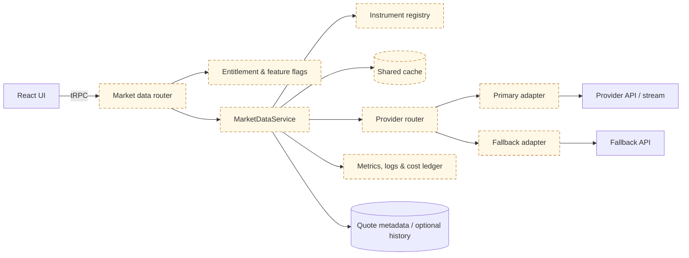
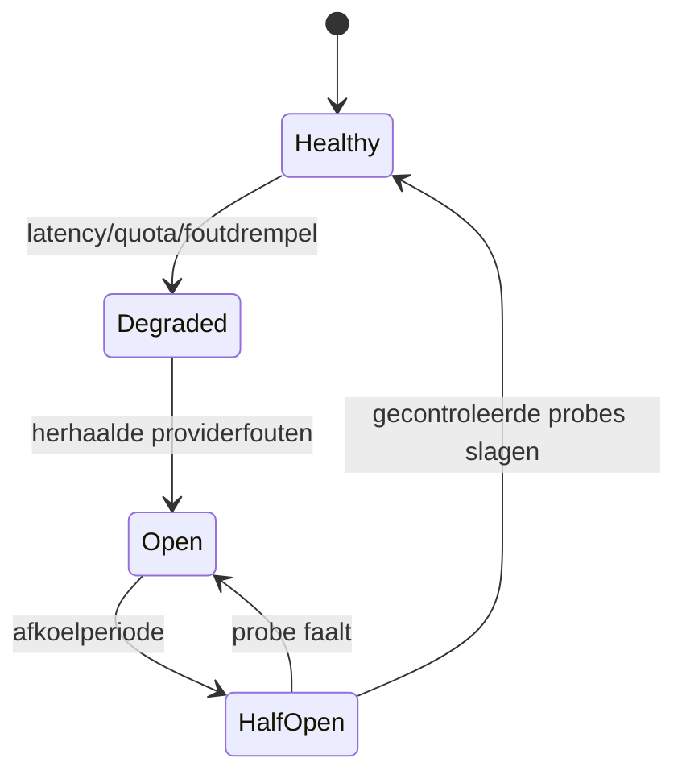

# Marktdata-architectuur — provideronafhankelijk ontwerp

**Versie:** 1.0  
**Laatst bijgewerkt:** 16 juli 2026  
**Status:** Goedgekeurd doelontwerp; providerintegratie is nog niet geïmplementeerd  
**Eigenaar:** CTO / Engineering

> Dit document legt het interne marktdata-contract vast. Het beschrijft geen reeds actieve koersfeed. Geen enkele koers mag als “real-time” worden getoond zolang de technische feed, beurslicentie, externe weergaverechten en premium-entitlement niet aantoonbaar actief zijn.

## 1. Beslissing en uitgangspunten

Trimilix bouwt niet rechtstreeks op het responseformaat van één marktdata-aanbieder. Alle providerdata passeert een server-side adapter die instrumenten, koersen, tijdstempels, valuta, beurs, actualiteit en kwaliteitsstatus normaliseert. De browser ontvangt nooit een providersleutel en communiceert niet rechtstreeks met een provider.

De eerste productfase gebruikt **end-of-day- of vertraagde koersen**. Marketstack blijft een budgetkandidaat na schriftelijke bevestiging van de gewenste Europese ETF-symbolen en externe klantweergaverechten. EODHD blijft het alternatief met sterker publiek bevestigde Europese beursdekking, maar commerciële weergave vereist een offerte en toestemming.[1] [2] De latere real-time premiumfase richt zich op Twelve Data Business, omdat de publieke documentatie externe weergaverechten, EU-marktdata en WebSockets beschrijft; aanvullende beursgoedkeuringen en kosten kunnen nog steeds gelden.[3] [4]

| Principe | Verplichte toepassing |
|---|---|
| Provideronafhankelijkheid | UI, routers en domeinservices kennen uitsluitend het interne contract. |
| Server-side geheimen | API-sleutels bestaan alleen in beveiligde serverconfiguratie. |
| Eerlijke actualiteit | Iedere koers bevat bron-, markt- en ontvangsttijd plus een zichtbaar actualiteitslabel. |
| Licentie vóór techniek | Een technisch beschikbare feed wordt pas gebruikt wanneer het contract het productgebruik toelaat. |
| Gedeelde verzoeken | Eén gecachte quote per instrument en actualiteitsklasse; nooit één providercall per gebruiker. |
| Gecontroleerde degradatie | Bij storing wordt de data aantoonbaar ouder of onbeschikbaar, nooit stilzwijgend “real-time”. |
| Reversibiliteit | Providers kunnen per capability worden vervangen zonder het publieke API-contract te breken. |

## 2. Componentgrenzen



Alle componenten in dit diagram zijn **gepland**, behalve de bestaande tRPC-, database- en authenticatiefundamenten. De eerste implementatie blijft binnen de modulaire monoliet. Een afzonderlijke markt dataservice wordt pas gerechtvaardigd door gemeten belasting, onafhankelijke deploymentnoden of providerconnecties die niet betrouwbaar binnen het autoscalemodel passen.

## 3. Canoniek domeinmodel

Instrumenten worden intern geïdentificeerd met een stabiele Trimilix-ID. Providersymbolen zijn mappings en nooit de primaire identiteit. Waar beschikbaar bewaren we ISIN, MIC, beurs, handelsvaluta en instrumenttype. Een ticker zonder beurscontext is onvoldoende, omdat dezelfde ticker op meerdere noteringsplaatsen kan voorkomen.

```ts
export type QuoteMode = "end_of_day" | "delayed" | "realtime";
export type QuoteStatus =
  | "fresh"
  | "stale"
  | "indicative"
  | "market_closed"
  | "unavailable";

export interface InstrumentRef {
  instrumentId: string;
  isin?: string;
  ticker: string;
  mic: string;
  exchange: string;
  currency: string;
  assetClass: "etf" | "equity" | "fund" | "other";
}

export interface CanonicalQuote {
  instrument: InstrumentRef;
  price: string; // decimale tekst; geen binary float voor financiële opslag
  currency: string;
  marketTimestampMs: number;
  receivedTimestampMs: number;
  mode: QuoteMode;
  status: QuoteStatus;
  delaySeconds: number | null;
  sourceProvider: string;
  sourceRequestId?: string;
  isDerived: boolean;
  licensePolicyId: string;
}
```

Alle tijdstempels zijn UTC Unix milliseconden. De UI converteert enkel voor weergave naar de lokale tijdzone. Geldwaarden worden als decimalen verwerkt en opgeslagen; providerfloats worden bij de adaptergrens gevalideerd en genormaliseerd.

## 4. Intern providercontract

```ts
export interface ProviderCapabilities {
  modes: QuoteMode[];
  exchanges: string[];
  assetClasses: string[];
  supportsBatchQuotes: boolean;
  supportsHistory: boolean;
  supportsStreaming: boolean;
  maxBatchSize: number;
}

export interface MarketDataProvider {
  readonly id: string;
  getCapabilities(): Promise<ProviderCapabilities>;
  resolveInstruments(instruments: InstrumentRef[]): Promise<ProviderSymbolMap[]>;
  getQuotes(request: QuoteRequest): Promise<CanonicalQuote[]>;
  getHistory(request: HistoryRequest): Promise<CanonicalBar[]>;
  healthCheck(): Promise<ProviderHealth>;
}

export interface StreamingMarketDataProvider extends MarketDataProvider {
  subscribe(request: StreamRequest, sink: QuoteSink): Promise<SubscriptionHandle>;
}
```

Adapters zijn verantwoordelijk voor schema-validatie, providerfoutnormalisatie, symbolmapping, tijdstempels, valuta en licentiepolicy. Adapters mogen geen gebruikers- of abonnementslogica bevatten. De `MarketDataService` beslist welke provider, actualiteitsklasse en cachepolicy gelden.

| Foutklasse | Intern gedrag | Externe respons |
|---|---|---|
| `PROVIDER_TIMEOUT` | Beperkte retry met jitter; daarna circuit breaker | Tijdelijk onbeschikbaar of gelabelde stale quote |
| `RATE_LIMITED` | Geen agressieve retry; quota-alarm en backoff | Gecachte quote of neutrale fout |
| `SYMBOL_NOT_FOUND` | Mapping als ongeldig markeren | Instrument niet ondersteund |
| `LICENSE_BLOCKED` | Geen fallback zonder equivalente rechten | Functie niet beschikbaar |
| `INVALID_PROVIDER_DATA` | Payload weigeren en datakwaliteitsalarm | Laatste geldige quote met stale-label of fout |
| `AUTH_FAILED` | Circuit openen en secret/config-alarm | Geen providerdetail naar gebruiker |

## 5. Instrumentregister en datakwaliteit

Het instrumentregister bewaart per interne ETF de toegelaten noteringsplaatsen en provider mappings. Een mapping wordt pas actief na automatische en handmatige validatie van ticker, ISIN, MIC, valuta en instrumentnaam. Een ETF op Euronext Amsterdam mag niet stilzwijgend vervangen worden door dezelfde ETF op een andere beurs of in een andere valuta.

| Controle | Blokkerend? | Reden |
|---|---:|---|
| ISIN komt overeen | Ja, indien beschikbaar | Voorkomt verkeerd instrument |
| MIC/beurs komt overeen | Ja | Borgt noteringsplaats en licentiecontext |
| Valuta komt overeen | Ja | Voorkomt foutieve portefeuillewaardering |
| Timestamp ligt niet in de toekomst | Ja | Detecteert corrupte providerdata |
| Prijs is positief en numeriek | Ja | Basale integriteitscontrole |
| Afwijking tegenover vorige geldige quote | Waarschuwing / quarantaine | Detecteert splits, mappingfouten of uitschieters |
| Provideractualiteit past bij productlabel | Ja | Verhindert vals “real-time”-label |

Corporate actions, splits en valutaomrekening zijn afzonderlijke capabilities. Zonder aantoonbare ondersteuning worden historische rendementsberekeningen niet als total return voorgesteld.

## 6. Cachingstrategie

Caching wordt bepaald door **contract, marktstatus, productmodus en datakwaliteit**, niet door een hardcoded globale TTL. De cache is gedeeld tussen applicatie-instanties; lokaal procesgeheugen mag hoogstens als niet-kritieke microcache dienen.

| Data | Startpolicy | Opmerking |
|---|---|---|
| Instrumentmetadata | 24 uur | Eerder verversen bij mappingwijziging of providercorrectie. |
| End-of-dayquote | Tot nieuwe geldige handelsdagdata | Altijd markt- en ontvangsttijd tonen. |
| Vertraagde quote | 60–300 seconden | Exacte TTL wordt contractueel en op quota afgestemd. |
| Real-timequote | 1–5 seconden of streamgedreven | Enkel wanneer licentie en productbelofte dit toelaten. |
| Historische bars | Lange cache na gesloten periode | Corrigeerbaar bij corporate actions. |
| Negatieve symbollookup | Korte negatieve cache | Vermijdt herhaalde kost, maar laat snelle mappingcorrectie toe. |

Cachekeys bevatten minimaal `provider`, `instrumentId`, `exchange`, `currency`, `mode` en relevante granulariteit. Real-time en vertraagde data delen nooit dezelfde key. Stampede protection bundelt gelijktijdige misses tot één providerrequest. Batchquotes worden gebruikt waar de provider dat ondersteunt.

> **Stale-while-revalidate-regel:** stale data mag alleen worden teruggegeven wanneer de licentie dat toelaat, de laatst geldige timestamp bewaard blijft en de UI zichtbaar “vertraagd” of “laatst bijgewerkt op …” toont.

## 7. Providerselectie en failover

Failover is een beleidsbeslissing, geen generieke technische switch. Een fallbackprovider moet hetzelfde instrument, dezelfde beurs, dezelfde valuta, een toegelaten actualiteitsklasse en voldoende externe weergaverechten leveren. Anders degradeert de service transparant naar een oudere klasse of naar onbeschikbaar.



| Situatie | Toegelaten gedrag |
|---|---|
| Primary real-time faalt, fallback heeft equivalente rechten | Fallback gebruiken en providerwissel meten. |
| Primary real-time faalt, fallback is enkel vertraagd | Alleen vertraagd tonen met gewijzigd label; geen real-timeclaim. |
| Quota bijna opgebruikt | Batchen, cacheduur binnen contract verruimen en niet-kritieke refreshes stoppen. |
| Beide providers falen | Laatste geldige quote met timestamp tonen indien toegestaan; anders neutrale fout. |
| Symboolmapping verschilt | Geen automatische fallback tot mapping gevalideerd is. |
| Licentie of factuurstatus onzeker | Globale kill switch; providerfunctie uitschakelen. |

Retries zijn begrensd, gebruiken exponentiële backoff met jitter en worden alleen toegepast op veilige leesoperaties. Circuit-breakerstatus moet gedeeld worden zodra meerdere stateless instanties actief zijn.

## 8. Premium-entitlement en real-timeactivering

Een betalend abonnement alleen activeert real-timekoersen niet. Toegang vereist dat **alle** volgende voorwaarden waar zijn:

| Gate | Voorwaarde |
|---|---|
| Abonnement | Server-side geverifieerde actieve premiumstatus. |
| Productfeature | `marketData.realtime.enabled` staat globaal aan. |
| Provider | Provideraccount, quota en health zijn geldig. |
| Licentie | Externe weergave, betrokken beurs en instrumenttype zijn schriftelijk toegestaan. |
| Kosten | Interne activatiedrempel en budgetalarm zijn groen. |
| Gebruiker | Eventuele professional/non-professional-classificatie is verwerkt. |
| Operationeel | Monitoring, kill switch en incidentprocedure zijn getest. |

De veilige evaluatievolgorde is: authenticatie → abonnementsentitlement → globale feature flag → licentiepolicy → providercapaciteit → quota/budget → quote. De UI mag alleen de serverbeslissing weergeven en kan geen entitlement afdwingen.

Voor de financiële activering gebruiken we een conservatieve drempel:

```text
minimale betalende gebruikers =
  ceil((veiligheidsfactor × totale maandelijkse datakost) /
       brutomarge per premiumgebruiker)
```

De veiligheidsfactor start op 2 en wordt 3 zolang omzet of providerkost volatiel is. Totale datakost omvat providerabonnement, beurskosten, professionele gebruikerskosten, wisselkoersbuffer en operationele marge. Twelve Data vermeldt publiek een Business Venture-prijs van ongeveer $499 per maand bij maandfacturatie, vóór mogelijke aanvullende beurskosten.[3] Deze prijs is enkel een planningsinput en moet vóór aankoop opnieuw worden bevestigd.

## 9. Streamingarchitectuur

Een latere WebSocketintegratie gebruikt een beperkt aantal **server-side gedeelde verbindingen**. De server abonneert zich op de actieve symbolenset, normaliseert updates en distribueert uitsluitend naar geautoriseerde sessies. De exacte redistributievorm moet contractueel toegestaan zijn; een technisch werkende fan-out bewijst geen licentierecht.[4]

| Onderdeel | Verantwoordelijkheid |
|---|---|
| Connection manager | Verbinden, authenticeren, heartbeat, reconnect met jitter. |
| Subscription registry | Referentietelling per instrument en gecontroleerd unsubscribe. |
| Normalizer | Providerpayload omzetten naar `CanonicalQuote`. |
| Shared last-value cache | Laatste geldige update voor alle instanties beschikbaar maken. |
| Entitlement gateway | Alleen toegelaten gebruikers en modes doorlaten. |
| Fan-out transport | SSE of WebSocket naar clients; keuze op basis van gemeten noden. |
| Cost guard | Maximum symbolen, verbindingen, berichten en budget bewaken. |

Autoscale-instanties kunnen naar nul schalen. Een permanente provider-WebSocket kan daarom een gereserveerde of afzonderlijke always-on runtime vereisen. Die hostingkeuze wordt pas gemaakt wanneer de premiumfase commercieel wordt goedgekeurd.

## 10. Observability en kostenbewaking

Alle marktdata-acties gebruiken gestructureerde events zonder geheime sleutels of volledige providerpayloads. Instrument-ID en providerrequest-ID mogen worden gelogd; gebruikers-ID’s worden gepseudonimiseerd wanneer correlatie noodzakelijk is.

| SLI | Labels | Eerste alarmrichting |
|---|---|---|
| Providerbeschikbaarheid | provider, endpoint, mode | Foutpercentage boven overeengekomen grens. |
| Providerlatency | provider, endpoint, p50/p95/p99 | p95 overschrijdt intern budget. |
| Quote-actualiteit | exchange, mode, leeftijd | Real-time of delayed SLO wordt geschonden. |
| Cache-hitratio | provider, mode | Daling veroorzaakt meer kost en latency. |
| Quota | provider, plan, periode | 70%, 85% en 95% verbruik. |
| Datakwaliteit | fouttype, exchange | Mapping- of validatiefouten stijgen. |
| Fan-out | actieve symbolen, clients, berichten/s | Capaciteits- en kosttrend. |
| Kosten | provider, feature, plan | Forecast overschrijdt maandbudget. |
| Degradaties | van-mode, naar-mode, reden | Productbelofte en incidentimpact. |

Metrics met hoog-cardinale labels zoals ruwe user-ID of request-ID worden vermeden. Request-ID’s horen in logs/traces, niet in metrieklabels.

## 11. Security- en privacyvereisten

Providersleutels worden uitsluitend via de projectsecretbeheerlaag ingesteld en nooit naar de frontend gebundeld. Providerresponses worden als onvertrouwde input behandeld en schema-gevalideerd. Server-side time-outs, responsegroottelimieten en toegestane hostnames beperken SSRF- en resource-exhaustionrisico’s.

Rate limiting geldt per gebruiker, IP, endpoint en abonnementsklasse, met strengere limieten voor historische bulkdata. Foutmeldingen lekken geen providersleutel, contractdetail of ruwe response. Logs bevatten geen volledige portefeuille of betaalgegevens.

## 12. Teststrategie en acceptatiecriteria

| Testlaag | Verplicht bewijs |
|---|---|
| Unit | Normalisatie, timestamps, decimalen, statusmapping en entitlementbeslissingen. |
| Contract | Opgenomen providerfixtures valideren tegen adapters zonder live secrets. |
| Integratie | Sandboxprovider, cache, timeout, quota en failover. |
| Security | Sleutels niet in clientbundle/logs; cross-user entitlement wordt geweigerd. |
| Datakwaliteit | Verkeerde valuta, ticker, toekomsttimestamp en uitschieter worden geblokkeerd. |
| Load | Batch- en cachegedrag bij gelijktijdige portefeuilleviews. |
| Resilience | Timeout, 429, corrupte payload, disconnect en provideruitval. |
| Licentie-UAT | Labels, timestamps en toegangssegmenten komen overeen met contract. |

De MVP-providerintegratie is pas done wanneer typecheck, tests, secretscan, dependencyaudit en productiebuild slagen én een schriftelijk licentiebewijs aan de providerpolicy is gekoppeld.

## 13. Gefaseerd implementatiepad

| Fase | Scope | Exitcriterium |
|---|---|---|
| 0 — Contractbevestiging | ISIN’s, beurzen, klantweergave, caching en afgeleide waarden schriftelijk bevestigen | Ondertekende of schriftelijk bevestigde gebruiksrechten. |
| 1 — Intern contract | Types, adapterinterface, fixtures en fake provider | Contracttests slagen zonder externe sleutel. |
| 2 — EOD/vertraagde MVP | Eén provider, batchquotes, gedeelde cache, labels en kill switch | Betrouwbare quotes met correcte timestamp en kostmeting. |
| 3 — Redundantie | Tweede provider voor geselecteerde capabilities | Gecontroleerde failovertest zonder licentiebreuk. |
| 4 — Premium real-time | Businessfeed, streaming, entitlements en cost guard | Alle gates uit hoofdstuk 8 zijn groen. |
| 5 — Schaaloptimalisatie | Shared cache, dedicated connection manager of service | Gemeten SLO- of capaciteitsnood rechtvaardigt wijziging. |

## 14. Open beslissingen

| Beslissing | Eigenaar | Vereist vóór |
|---|---|---|
| Marketstack versus EODHD voor MVP | Product + CTO | Implementatiefase 2 |
| Schriftelijke externe weergaverechten | Legal/Product | Elke productiefeed |
| Cache- en opslagduur per provider | CTO + Legal | Persistente koersopslag |
| Professionele gebruikersclassificatie | Product + Legal | Real-time premiumlancering |
| SSE versus WebSocket naar browser | Engineering | Streamingimplementatie |
| Autoscale versus always-on runtime | CTO | Permanente providerstream |
| Exacte SLO’s en budgetdrempels | CTO + Finance | Productielancering |

## Referenties

[1]: https://marketstack.com/pricing "Marketstack — Pricing"
[2]: https://eodhd.com/financial-apis/commercial-vs-personal-license-use "EODHD — Commercial vs Personal License Use"
[3]: https://twelvedata.com/pricing-business "Twelve Data — Business Pricing"
[4]: https://support.twelvedata.com/en/articles/5332349-commercial-and-personal-usage "Twelve Data — Commercial and Personal Usage"
